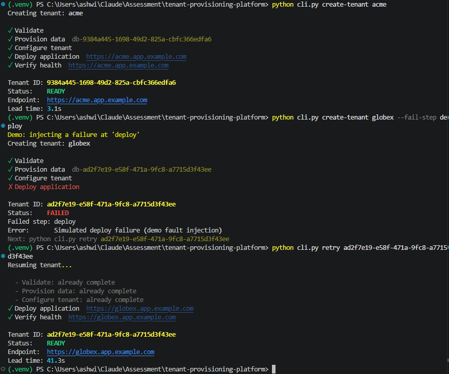
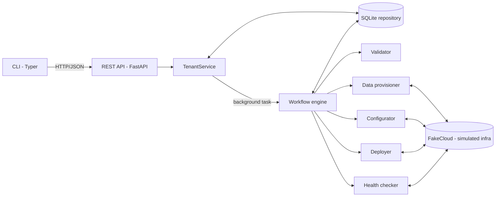
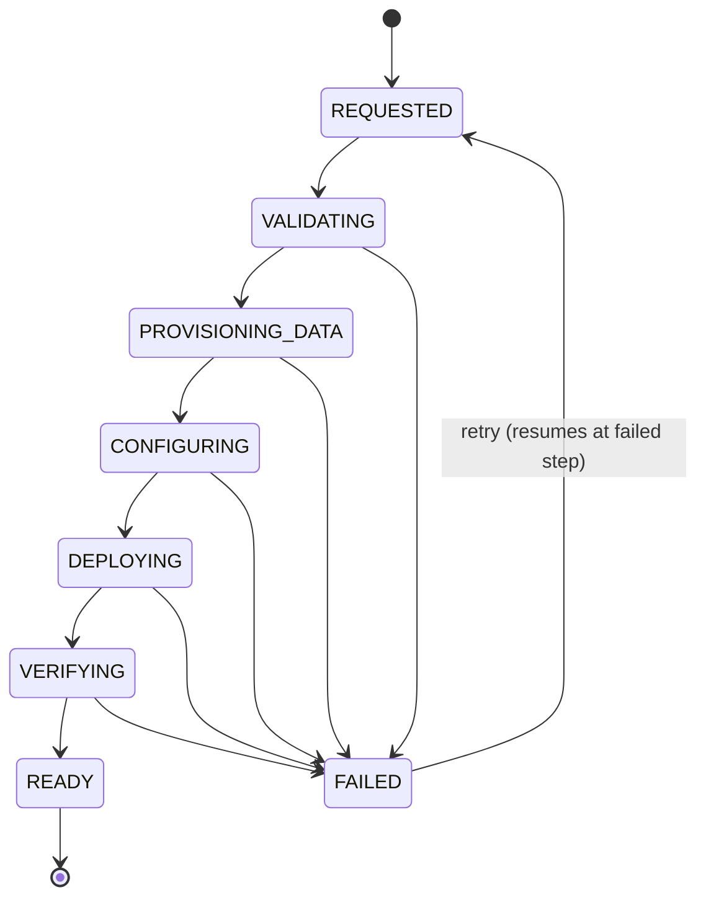

# Self-Service SaaS Tenant Provisioning Platform

A prototype self-service API + CLI that provisions a new SaaS customer tenant through a
stateful, multi-step workflow, survives a failure partway through, and resumes without
redoing completed work.

> **Prototype.** Infrastructure is simulated behind real adapter interfaces. Nothing here
> provisions AWS, Kubernetes or databases. See [Production handoff](#production-handoff).


<sub>Real run on Windows (Python 3.14). Since this capture, *Verify health* shows `healthy` instead of repeating the endpoint.</sub>

---

## Why this problem

In a multi-tenant B2B SaaS product, every new customer needs a data store, tenant
configuration (plan limits), an application route/deployment and a health check before
they can log in. Typically that is a ticket to the platform team, executed by hand, in
order. The result: days of queue time for minutes of work, platform toil that scales with
sales, tenants built slightly differently each time, and no record of what completed when
step 4 of 5 breaks.

## User

**Application engineers / platform consumers** asked to stand up a tenant for a new customer
(after a deal closes, or for a pilot). They know *what* the tenant needs (name, region,
plan) but don't own the infrastructure. Secondary user: the platform engineer who used to
run the ticket and now operates the self-service path.

## Product hypothesis

If application engineers can request a tenant with **one API call or CLI command**, backed
by a **workflow that records every step and can resume after failure**, then:

- median provisioning lead time drops from days to minutes,
- tenant-creation tickets to the platform team drop toward zero,
- partial failures are recovered by `retry`, not escalation.

They'd adopt it because it's **faster than the ticket on day one**, uses inputs they already
know, and keeps failure **visible and recoverable by them**. Full brief:
[docs/product-brief.md](docs/product-brief.md).

## Metrics

| | Metric | In the prototype |
|---|---|---|
| **Primary** | **Median tenant provisioning lead time**: request accepted → `READY` | `created_at`/`ready_at` per tenant; `GET /api/v1/metrics` |
| Secondary | Self-service adoption (% of new tenants via API vs. ticket) | needs ticket data; production |
| | First-attempt success rate, retry success rate | derivable from step `attempts` |
| | Manual interventions per tenant, P95 lead time | production |

Lead time includes failure and retry time (the globex run above: 41 s, of which ~38 s was a
human deciding to retry). That's deliberate: it is what the requester actually waited.

---

## Demo

Two terminals, from the repo root, with the virtual environment active (setup below).

**Terminal 1 — API**

```powershell
uvicorn app.main:create_app --factory --no-access-log
```

**Terminal 2 — CLI**

```powershell
# 1. Happy path
python cli.py create-tenant acme

# 2. Failure partway through (demo-only fault injection)
python cli.py create-tenant globex --fail-step deploy

# 3. Retry: resumes at deploy; completed steps are skipped
python cli.py retry <globex-tenant-id>

# Inspect any tenant (attempts per step, errors, outputs)
python cli.py status <tenant-id>
```

Worth trying as well:

| Command | Shows |
|---|---|
| `python cli.py retry <acme-tenant-id>` | `409 invalid_tenant_state`: only FAILED tenants can be retried |
| `python cli.py create-tenant bad --region mars-1` | Fails at **Validate**; CLI advises a new request, not a retry |
| `python cli.py create-tenant initech --tenant-model siloed` | `422 unsupported_tenant_model`: in the contract, not built |
| Stop the API mid-run (Ctrl+C), start it again | The interrupted tenant becomes `FAILED` ("Interrupted…") and `retry` resumes it |

Interactive API docs: http://127.0.0.1:8000/docs

---

## Running locally

Requires **Python 3.11+** (full suite verified on Windows, Python 3.14).

**Windows (PowerShell)**

```powershell
git clone https://github.com/ashwin139/tenant-provisioning-platform.git
cd tenant-provisioning-platform
python -m venv .venv
.\.venv\Scripts\Activate.ps1      # if blocked: Set-ExecutionPolicy -Scope CurrentUser RemoteSigned
python -m pip install -r requirements.txt
pytest
```

**macOS / Linux**

```bash
git clone https://github.com/ashwin139/tenant-provisioning-platform.git
cd tenant-provisioning-platform
python3 -m venv .venv
source .venv/bin/activate
python -m pip install -r requirements.txt
pytest
```

| Setting (env var) | Default | Purpose |
|---|---|---|
| `TENANT_DB_PATH` | `tenants.db` | SQLite file for tenant state |
| `SIM_STEP_DELAY_SECONDS` | `0.6` | Simulated time per step |
| `TENANT_API_URL` | `http://127.0.0.1:8000` | Where the CLI sends requests |

To reset: stop the API and delete `tenants.db` and `tenants.db.fakecloud.json`.

---

## Architecture



| Layer | File(s) | Owns |
|---|---|---|
| CLI | `cli.py` | Developer experience; talks to the API over HTTP only |
| API | `app/main.py` | HTTP contract, status codes, one error shape |
| Service | `app/service.py` | Business rules (siloed rejected, retry only from FAILED), metrics |
| Workflow | `app/workflow/engine.py` | Step order, state transitions, failure capture, resume |
| Adapters | `app/adapters/*.py` | Side effects, one per step, each idempotent per tenant |
| Persistence | `app/repository.py` | SQLite behind a small interface |

More detail: [docs/architecture.md](docs/architecture.md) · capabilities:
[docs/capability-map.md](docs/capability-map.md)

## Workflow



Each step record keeps `status`, `attempts`, `started_at`, `finished_at`, `error` and
`output` (e.g. `db-<tenant-id>`). The tenant keeps `status`, `current_step`, `failed_step`,
`error`, `created_at`, `ready_at` and `lead_time_seconds`. A tenant is `READY` only when all
five steps have succeeded.

## API

Base path `/api/v1`. Errors always look like
`{"error": {"code": "...", "message": "...", "details": [...]?}}`.

| Method & path | Success | Errors |
|---|---|---|
| `POST /tenants` | `202` tenant (`REQUESTED`); workflow runs in background | `409 duplicate_tenant_name` · `422 unsupported_tenant_model` · `422 validation_error` |
| `GET /tenants/{id}` | `200` tenant with step-level state | `404 tenant_not_found` |
| `POST /tenants/{id}/retry` | `202` tenant re-queued; resumes at the failed step | `404` · `409 invalid_tenant_state` (running or READY) |
| `GET /metrics` | `200` counts by status, median lead time | |

```json
POST /api/v1/tenants
{ "name": "acme", "region": "ca-central-1", "plan": "standard", "tenant_model": "pooled" }
```

`plan`: `starter | standard | enterprise`. `tenant_model`: `pooled` (`siloed` is in the
contract and rejected). Regions are checked by the **validate step** (`ca-central-1`,
`us-east-1`, `eu-west-1`), so policy can change without changing the API.
`fail_step` (`validate | provision_data | configure | deploy | verify`) is **demo/test only**.

## Failure recovery and idempotency

- **Every transition is persisted** (SQLite) before the next step starts. Any exception marks
  the step and tenant `FAILED` with `failed_step` and `error`; nothing is left `RUNNING`.
- **Retry resumes, it doesn't restart.** `POST /retry` is accepted only from `FAILED`
  (atomic check-and-set, so two concurrent retries can't both run). The engine skips steps
  already `SUCCEEDED` and re-runs from the failed one.
- **Two layers of idempotency:**
  1. *Engine*: completed steps are never re-executed.
  2. *Adapters*: each step is safe to repeat. The data provisioner derives `db-<tenant-id>`
     and reuses it if it exists; config and deployment are upserts. This covers a crash
     *after* a side effect but *before* the state write; a test simulates exactly that and
     proves only one database is created.
- **Interrupted runs:** on startup, tenants caught mid-run are marked `FAILED`
  ("Interrupted…") so `retry` can resume them.
- **Fault injection** (`fail_step`) fails the named step on its **first attempt** only, so a
  plain retry succeeds. It lives in the engine, not the adapters, and is not a production
  capability.
- **Retry is for transient failures.** A bad request (e.g. unsupported region) fails
  validation again; the fix is a new request with corrected input.

## Prototype decisions

| Decision | Why, within a 2–4 h timebox |
|---|---|
| **SQLite**, not in-memory (originally planned) or Postgres | The story is "resume after failure"; in-memory state dies with the process. Stdlib, zero setup. Postgres is a pod item. |
| **Simulated infrastructure** behind real adapter classes | Tests the contract and failure semantics, not cloud plumbing. No credentials for evaluators. Swapping an adapter doesn't touch the engine or API. Simulated state is persisted too, because real infrastructure outlives the API. |
| **Hand-written state machine** (~100 lines), not Temporal | Explainable end to end, no framework magic. It marks exactly where Temporal / Step Functions plugs in later. |
| **Async: `202` + polling** | Real provisioning takes minutes; a long-held request is fragile. Makes state visible and suits portals and CI. |
| **CLI, not React** | The user is an engineer; a CLI is the fastest useful surface and is scriptable (exit codes `0` READY, `1` failed/error, `2` API down, `3` timeout). The API is UI-agnostic. |
| **Only `pooled` tenancy** | `tenant_model` is in the contract so siloed can be added without a breaking change; the prototype rejects it explicitly instead of pretending. |
| **Manual retry, no rollback** | Covers the common transient case. Compensation needs an `undo()` per adapter; it's in the backlog. |

## Production handoff

The prototype fixes the **contract and behaviour**: API shape, error model, workflow states,
retry/idempotency semantics, and the lead-time metric. The pod makes it real, roughly in
this order (full backlog: [docs/backlog.md](docs/backlog.md) and the repo's GitHub Issues, milestones M1–M4):

1. **Foundations:** Postgres; authN (OIDC) + RBAC; client idempotency keys on `POST`; CI/CD.
2. **Real provisioning:** durable orchestrator (Temporal / Step Functions) replacing
   `WorkflowEngine`; real adapters (Terraform/Pulumi for data, Kubernetes/GitOps for deploy,
   secrets manager, HTTP health probes); timeouts and retry with backoff.
3. **Reliability & operability:** compensation / deprovision (`DELETE`); retryable vs.
   permanent failure classification; audit log; OpenTelemetry traces; metrics export and
   dashboards; SLOs on lead time.
4. **Governance & scale:** quotas, policy-as-code, siloed tenancy, multi-region.

## Known limitations

- **Single API process.** Startup recovery assumes no other worker is running a tenant.
- **No automatic retries, timeouts or backoff;** retry is manual.
- **No rollback or deprovisioning.** A tenant that keeps failing leaves earlier resources.
- **Names stay reserved by failed requests**, and there is no `DELETE`: after a validation
  failure, use a different name. (Backlog.)
- **Simulated infra and tenant state are separate stores**, not one transaction; adapter
  idempotency is what makes a crash between them safe.
- **No auth, rate limits or quotas;** `fail_step` is exposed for demo purposes.

## Repository guide

```
cli.py                 Typer CLI
app/                   API, service, workflow engine, adapters, repository
tests/                 34 behaviour tests (API, workflow, retry, recovery, CLI)
docs/product-brief.md  user, problem, hypothesis, metrics, scope
docs/capability-map.md capabilities tagged Prototype / Production MVP / Future
docs/architecture.md   boundaries, states, retry semantics, production changes
docs/backlog.md        production backlog (17 issues, M1–M4), sequencing and rationale
scripts/create_issues.py  creates the GitHub milestones/labels/issues from docs/backlog.md
docs/ai-log/           build guide I wrote to direct Claude, and the AI interaction log
```

## How AI was used

Built with Claude as a pair programmer, under a phase-by-phase guide I wrote
([docs/ai-log/build-guide.md](docs/ai-log/build-guide.md)). I made the product and design
calls; Claude implemented, and I reviewed and tested each phase. Course corrections are
visible in the history and the log: async `202` + polling instead of synchronous calls,
SQLite instead of in-memory state, retry semantics fixed before implementation, and the
Phase 7 review that found interrupted runs got stuck and that retry broke after a restart.
