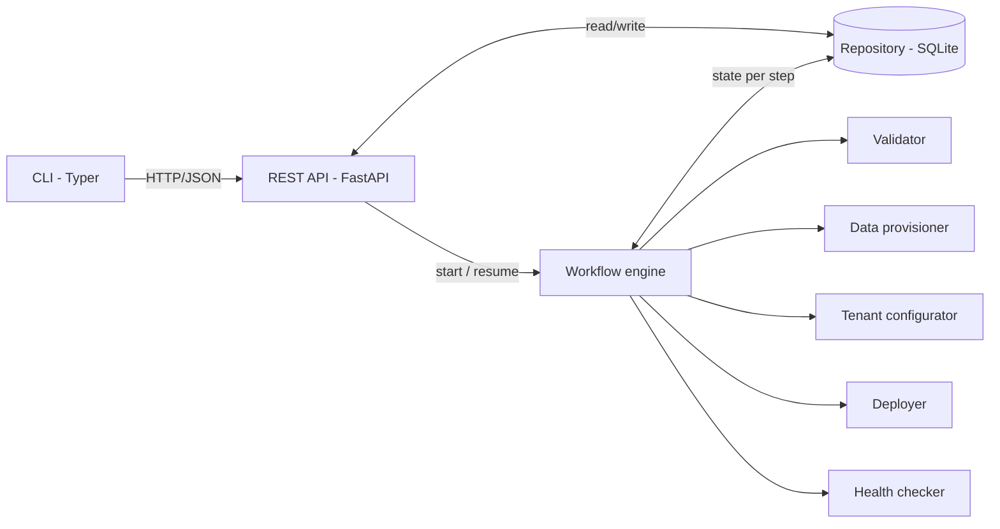
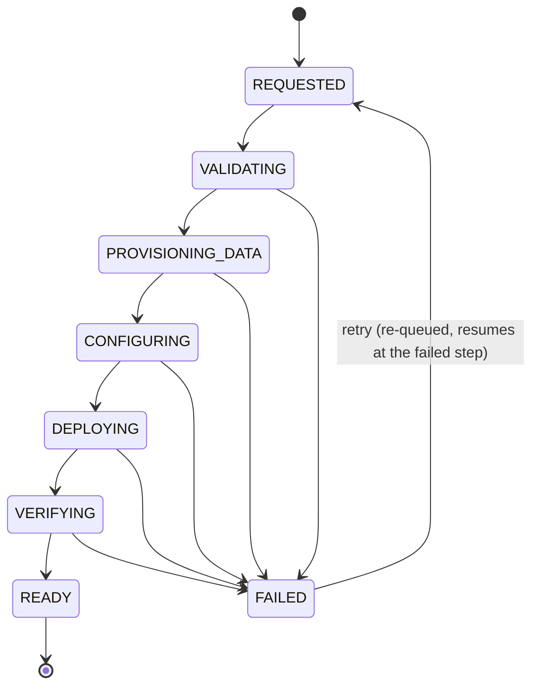

# Architecture



## Boundaries

**API boundary (FastAPI).** Validates input, enforces the contract (status codes, error
shape), and hands work to the service layer. Route handlers contain no workflow logic.
`POST` returns `202 Accepted` with `tenant_id`; the workflow runs in a background task.

**Orchestration boundary (workflow engine).** A small hand-written state machine. It owns
step order, state transitions, persistence of each transition, failure capture and
resume. It knows *that* a step runs, not *how*.

**Adapter boundary.** One class per operation with a common interface:

```python
class StepAdapter(Protocol):
    def run(self, tenant: Tenant) -> StepResult: ...
```

Adapters own side effects and must be idempotent per `tenant_id`. In the prototype they
simulate work; in production each is replaced by a real integration with no change to
the engine or API.

**Persistence (repository).** A small repository interface over SQLite. Every state
transition is written before the next step starts.

## Workflow states



| Step id | Tenant state while running |
|---|---|
| `validate` | VALIDATING |
| `provision_data` | PROVISIONING_DATA |
| `configure` | CONFIGURING |
| `deploy` | DEPLOYING |
| `verify` | VERIFYING |

Each step record holds `status` (PENDING / RUNNING / SUCCEEDED / FAILED), `attempts`,
`started_at`, `finished_at`, `error`, `output` (e.g. `db-<tenant-id>`).
The tenant holds `status`, `current_step`, `failed_step`, `error`, `created_at`, `ready_at`.
A tenant becomes READY only when all five steps are SUCCEEDED.

## Retry and resume

- `POST /tenants/{id}/retry` is accepted only from `FAILED` and returns `202`; the tenant is
  re-queued (`REQUESTED`) and the workflow runs again in the background.
  `409 invalid_tenant_state` if the tenant is running or already READY; `404` if unknown.
  The FAILED → REQUESTED check-and-set is atomic, so two concurrent retries cannot both start a run.
- The engine walks the steps in order and **skips any step already SUCCEEDED**.
- The failed step is re-run; later steps run only after it succeeds.
- **Two layers of idempotency:**
  1. *Engine* — completed steps are not re-executed.
  2. *Adapter* — each adapter checks whether its effect already exists for this tenant
     (e.g. reuses `db-<tenant-id>`). This covers a crash after the side effect but before
     the state write, where the engine would legitimately re-run the step.
- **Retry is for transient failures.** A bad request (e.g. an unsupported region) fails
  validation again on retry; the fix is a new request with corrected input. Classifying
  failures as retryable / non-retryable is a backlog item.
- Lead time is measured `created_at → ready_at`, so it includes failure and retry time:
  that is what the requester actually experienced.
- Failure injection (`fail_step`, demo-only) fails the **first attempt** of the named step,
  so a plain retry succeeds.

## Why infrastructure is simulated

The assessment tests the product call, contract and failure semantics, not cloud
plumbing. Real Terraform/Kubernetes calls would consume the timebox, need credentials an
evaluator doesn't have, and add nothing to the state/recovery story. Adapters are real,
executable classes with the production interface, so swapping them is a contained change.

## What changes in production

| Prototype | Production |
|---|---|
| FastAPI background task | Durable orchestrator (Temporal / Step Functions); workers separate from API |
| SQLite | Postgres + workflow history in the orchestrator |
| Simulated adapters | Terraform/Pulumi, Kubernetes/GitOps, secrets manager, real health probes |
| Manual retry only | Automatic retry with backoff + timeouts; manual retry for exhausted cases |
| No rollback | Compensation / deprovision for permanent failures |
| No auth | OIDC + RBAC; audit log |
| `fail_step` field | Removed; fault injection only in test environments |
| Lead time in DB | Metrics/traces exported (Prometheus, OpenTelemetry), SLOs |
