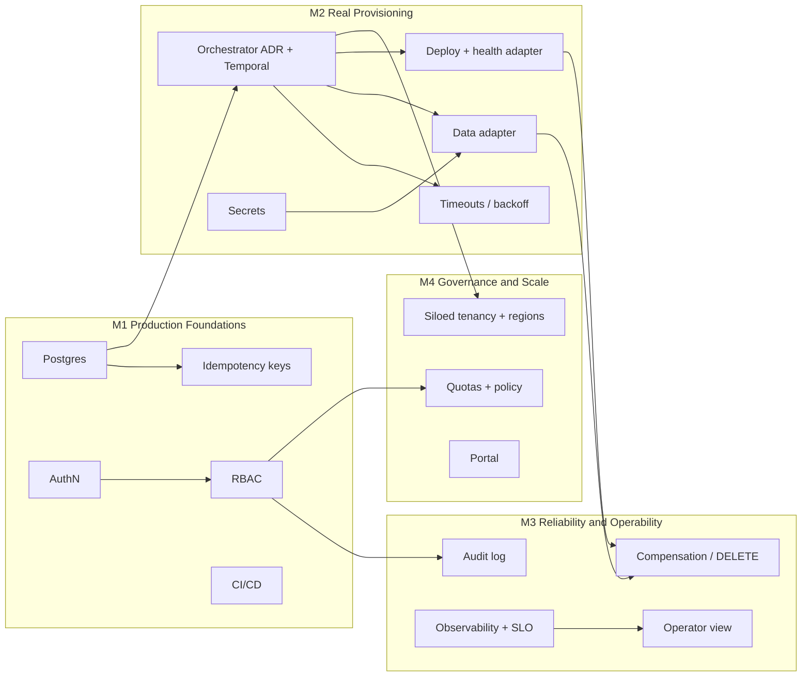

# Production Backlog

From prototype to platform product. 17 issues in 4 milestones, ordered by **dependency and
risk**, not by size. Each issue below becomes a GitHub Issue via
`python scripts/create_issues.py` (this file is the source of truth).

## Sequencing

**Why this order**

1. **M1 before anything real.** The prototype has no auth and a single-file database. Pointing
   it at real infrastructure first would create unauthenticated, untraceable tenants. M1 is
   low-risk, well-understood work that makes every later step safe.
2. **The orchestrator decision (M2-01) gates the adapters.** Writing real Terraform/Kubernetes
   adapters against the prototype engine, then porting them to Temporal, is wasted work. The
   adapter interface stays the same, so the ADR comes first and adapters follow.
3. **Timeouts and failure classification (M2-05) ship with the first real adapter,** because
   real infrastructure fails in ways the simulation doesn't (slow, partial, permanent).
4. **M3 makes it operable at volume.** Compensation needs real adapters to undo; dashboards
   need real traffic to be meaningful.
5. **M4 is demand-driven.** Siloed tenancy, quotas and a portal are built when adoption data
   says they're the bottleneck, not before.

**Not everything gets built.** M1 + M2 is the production MVP. M3 follows within the quarter;
M4 items are re-prioritised against adoption and lead-time data.

## Create these five first

| Issue | Why first |
|---|---|
| **M1-01** Postgres repository | Unblocks everything stateful; smallest change with the biggest risk reduction |
| **M1-02** Authentication | Nothing goes near real customers or infra without knowing who asked |
| **M1-05** CI/CD + contract tests | Protects the API contract the prototype established while the pod changes internals |
| **M2-01** Orchestrator ADR + Temporal | The highest-risk technical decision; deciding it early de-risks all of M2 |
| **M2-05** Timeouts, backoff, failure classes | Defines failure semantics before real adapters exist, so they're built to it |

---

## M1 — Production Foundations

### [M1-01] Durable persistence: Postgres repository
**Labels:** area:reliability, priority:P0
**Depends on:** none

**Why / outcome:** Tenant state must survive host loss and support multiple API instances.
SQLite on local disk does neither.

**Scope**
- `PostgresTenantRepository` implementing the existing `TenantRepository` interface.
- Schema migrations (Alembic). JSONB tenant document plus indexed `status`, `name`.
- `update_if_status` as a conditional `UPDATE ... WHERE status = $1` with a row version.

**Acceptance criteria**
- [ ] All existing tests pass against Postgres (testcontainers in CI).
- [ ] Two concurrent retries on one tenant: exactly one returns `202`.
- [ ] No API contract changes.

**Capability:** Workflow Reliability

### [M1-02] Authentication for API and CLI (OIDC)
**Labels:** area:governance, priority:P0
**Depends on:** none

**Why / outcome:** Every tenant request must be attributable to a person or pipeline.

**Scope**
- OIDC bearer-token validation on all `/api/v1` routes (company IdP).
- CLI login (device-code flow) and token caching; service tokens for CI.
- `requested_by` recorded on the tenant.

**Acceptance criteria**
- [ ] Unauthenticated calls return `401` in the standard error shape.
- [ ] `python cli.py login` works; existing commands unchanged after login.
- [ ] `requested_by` visible in `GET /tenants/{id}`.

**Capability:** Governance

### [M1-03] Authorization: team-scoped RBAC
**Labels:** area:governance, priority:P0
**Depends on:** M1-02

**Why / outcome:** Teams can manage their own tenants without seeing or retrying others'.

**Scope**
- Roles: `tenant.requester`, `tenant.operator`, `platform.admin`.
- Tenant owned by a team; list/get/retry scoped to that team.

**Acceptance criteria**
- [ ] Retry on another team's tenant returns `403`.
- [ ] Operators can view and retry any tenant; actions are attributed.

**Capability:** Governance

### [M1-04] Client idempotency keys on create
**Labels:** area:self-service, priority:P1
**Depends on:** M1-01

**Why / outcome:** A CI job that resends `POST /tenants` after a network timeout should get the
original tenant back, not a `409`.

**Scope**
- Optional `Idempotency-Key` header; key + request hash stored for 24 h.

**Acceptance criteria**
- [ ] Same key + same body returns the original `202` response.
- [ ] Same key + different body returns `422 idempotency_key_reused`.

**Capability:** Self-Service

### [M1-05] CI/CD pipeline and API contract tests
**Labels:** area:reliability, priority:P0
**Depends on:** none

**Why / outcome:** The prototype's main asset is its contract. Protect it while the pod
replaces everything behind it.

**Scope**
- GitHub Actions: lint, type-check, pytest on every PR.
- OpenAPI snapshot diff that fails on breaking changes.
- Build and publish the API image; deploy to a staging environment.

**Acceptance criteria**
- [ ] PRs blocked on failing tests or a breaking OpenAPI diff.
- [ ] Merge to `main` deploys to staging automatically.

**Capability:** Workflow Reliability

## M2 — Real Provisioning

### [M2-01] Durable workflow orchestrator (ADR, then Temporal)
**Labels:** area:reliability, priority:P0
**Depends on:** M1-01

**Why / outcome:** Runs must survive worker crashes and deploys without the startup
"interrupted" workaround, and scale beyond one process.

**Scope**
- ADR: Temporal vs. AWS Step Functions vs. keeping a DB-backed engine (criteria: durability,
  local dev, team skills, cost).
- Implement the chosen engine behind the current service; workers separate from the API.
- Remove demo fault injection (`fail_step`) from the production API; keep it in test config.

**Acceptance criteria**
- [ ] Killing a worker mid-step resumes automatically on another worker.
- [ ] Workflow history queryable per tenant.
- [ ] Prototype retry semantics preserved (skip completed steps; retry only from FAILED).

**Capability:** Workflow Reliability

### [M2-02] Data provisioning adapter
**Labels:** area:provisioning, priority:P0
**Depends on:** M2-01, M2-04

**Why / outcome:** Replace the simulated database with real tenant data isolation.

**Scope**
- Pooled model: schema-per-tenant on the shared cluster, created via migration tooling.
- Deterministic resource naming from `tenant_id`; existence check before create (idempotent).

**Acceptance criteria**
- [ ] Running the step twice creates one schema.
- [ ] Credentials written to the secrets manager, never to tenant state.

**Capability:** Provisioning

### [M2-03] Deployment and health adapters
**Labels:** area:deployment, priority:P0
**Depends on:** M2-01

**Why / outcome:** Route real traffic to the tenant and verify it end to end.

**Scope**
- Deploy: register tenant route/config via GitOps (PR to the env repo) or ingress API.
- Verify: HTTP probe of the tenant endpoint plus a DB connectivity check.

**Acceptance criteria**
- [ ] A READY tenant answers on its endpoint.
- [ ] Verify fails clearly when any dependency is missing.

**Capability:** Deployment

### [M2-04] Secrets management for tenant credentials
**Labels:** area:provisioning, priority:P0
**Depends on:** M1-02

**Why / outcome:** Tenant DB credentials and keys must never live in platform state or logs.

**Scope**
- Vault / AWS Secrets Manager integration; per-tenant secret paths; rotation hook.

**Acceptance criteria**
- [ ] No secret values in tenant documents, logs or API responses.
- [ ] Application reads tenant credentials from the secrets manager.

**Capability:** Provisioning

### [M2-05] Step timeouts, automatic retry with backoff, failure classes
**Labels:** area:reliability, priority:P0
**Depends on:** M2-01

**Why / outcome:** Most real failures are transient. Recover them automatically; send only
permanent ones to a human.

**Scope**
- Per-step timeout and retry policy (e.g. 3 attempts, exponential backoff with jitter).
- Classify errors as `retryable` / `permanent`; permanent (e.g. validation) skips retries.
- Expose `retryable` on the failed step; manual retry returns `409` for permanent failures.

**Acceptance criteria**
- [ ] A transient adapter error recovers with no manual action.
- [ ] A bad region fails once, marked permanent, and is not auto-retried.

**Capability:** Workflow Reliability

## M3 — Reliability & Operability

### [M3-01] Compensation and tenant deprovisioning (DELETE)
**Labels:** area:lifecycle, priority:P1
**Depends on:** M2-02, M2-03

**Why / outcome:** A tenant that can't be completed shouldn't leave orphaned resources, and
customers do churn. Also frees the tenant name (a known prototype limitation).

**Scope**
- `undo()` on every adapter (idempotent), run in reverse order.
- `DELETE /api/v1/tenants/{id}` for FAILED or READY tenants; `DEPROVISIONING` → `DELETED`.

**Acceptance criteria**
- [ ] After DELETE, no resources remain and the name can be reused.
- [ ] Deleting twice is safe.

**Capability:** Tenant Lifecycle

### [M3-02] Audit log
**Labels:** area:governance, priority:P1
**Depends on:** M1-03

**Why / outcome:** Who requested, retried or deleted which tenant, and when. Required for
customer-facing changes.

**Scope**
- Append-only audit events for every state-changing API call and workflow transition.

**Acceptance criteria**
- [ ] Every create/retry/delete has an event with actor, time and outcome.
- [ ] Events are queryable per tenant and exportable.

**Capability:** Governance

### [M3-03] Observability: traces, metrics, lead-time SLO
**Labels:** area:observability, priority:P1
**Depends on:** M2-01

**Why / outcome:** Measure the product outcome (lead time) and adoption, and see where time goes.

**Scope**
- OpenTelemetry traces across API, workflow and adapters (one trace per tenant run).
- Prometheus metrics: lead time histogram, step duration, failure rate per step.
- Adoption: % of new tenants via API vs. tickets (ticket-system export).
- Dashboard; SLO e.g. "P95 lead time < 15 min" (target set after baseline).

**Acceptance criteria**
- [ ] Median and P95 lead time visible per week.
- [ ] Alert when lead-time SLO or step failure rate breaches threshold.

**Capability:** Observability

### [M3-04] Operator view and runbooks
**Labels:** area:day-2, priority:P2
**Depends on:** M3-03

**Why / outcome:** Platform engineers need to find stuck or failing tenants before customers do.

**Scope**
- List/filter tenants by status and failed step; runbooks per failure class.

**Acceptance criteria**
- [ ] On-call can find all FAILED tenants older than 1 h in one query.
- [ ] Each permanent failure class links to a runbook.

**Capability:** Day-2 Operations

## M4 — Governance & Scale

### [M4-01] Quotas and policy-as-code guardrails
**Labels:** area:governance, priority:P2
**Depends on:** M1-03

**Why / outcome:** Self-service without guardrails creates cost and compliance risk.

**Scope**
- Per-team tenant quotas; OPA policies (allowed regions/plans per team) evaluated in validate.

**Acceptance criteria**
- [ ] Over-quota requests rejected at validate with a clear, permanent error.
- [ ] Policies changed without a deploy.

**Capability:** Governance

### [M4-02] Siloed tenancy and region placement
**Labels:** area:provisioning, priority:P2
**Depends on:** M2-01, M2-02, M2-03

**Why / outcome:** Enterprise customers needing dedicated infrastructure or data residency.
`tenant_model: siloed` is already in the contract (returns `422` today).

**Scope**
- Siloed workflow variant (dedicated stack per tenant) behind the same API.
- Region placement and residency rules.

**Acceptance criteria**
- [ ] `tenant_model: siloed` provisions a dedicated stack and reaches READY.
- [ ] Pooled behaviour unchanged.

**Capability:** Provisioning

### [M4-03] Self-service portal (Backstage plugin)
**Labels:** area:self-service, priority:P2
**Depends on:** M1-02

**Why / outcome:** Reach users who won't use a CLI (e.g. onboarding/CS teams), if adoption
data shows they're the gap.

**Scope**
- Backstage plugin over the same API: create, status, retry.

**Acceptance criteria**
- [ ] Feature parity with the CLI for the three core actions.
- [ ] No portal-only API endpoints.

**Capability:** Self-Service
