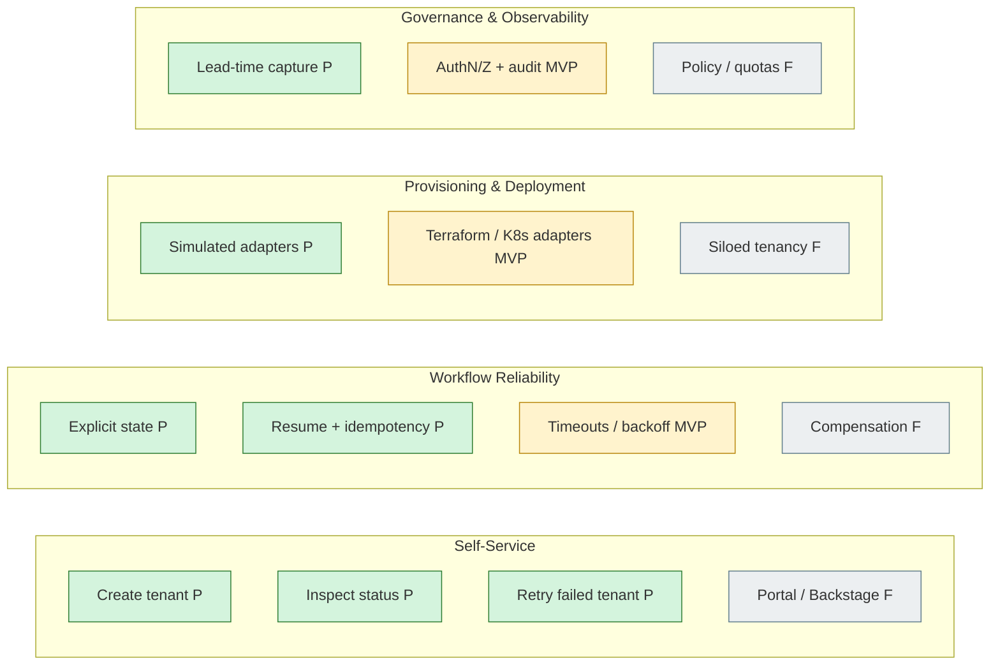

# Capability Map

Legend: **P** = Prototype (built here) · **MVP** = Production MVP (pod, first release) · **F** = Future

## 1. Self-Service

| Capability | Stage | Notes |
|---|---|---|
| Create tenant via API (`POST /api/v1/tenants`, 202) | P | name, region, plan, tenant_model |
| Inspect tenant status with step detail | P | `GET /api/v1/tenants/{id}` |
| Retry a failed tenant | P | `POST /api/v1/tenants/{id}/retry` |
| CLI over HTTP | P | Typer; same contract as API |
| List / search tenants | MVP | |
| Portal UI (Backstage plugin) | F | Same API |

## 2. Tenant Lifecycle

| Capability | Stage | Notes |
|---|---|---|
| States REQUESTED → … → READY / FAILED | P | |
| Duplicate name rejected (409) | P | |
| Deprovision / delete tenant | MVP | Optional stretch in prototype |
| Plan change / tenant update | F | |
| Suspend / reactivate | F | |

## 3. Provisioning

| Capability | Stage | Notes |
|---|---|---|
| Request validation | P | Region/plan allow-lists, name rules |
| Data provisioning (DB/schema) | P (simulated) | Idempotent: `db-<tenant-id>` |
| Tenant configuration (limits, flags) | P (simulated) | |
| Real data adapter (Terraform/RDS schema) | MVP | |
| Siloed tenancy (dedicated stack) | F | In contract; returns 422 today |
| Multi-region placement | F | |

## 4. Deployment

| Capability | Stage | Notes |
|---|---|---|
| Deploy / route tenant (simulated) | P | |
| Health verification (simulated) | P | Gate for READY |
| Real K8s / GitOps deploy adapter | MVP | |
| Progressive rollout per tenant | F | |

## 5. Workflow Reliability

| Capability | Stage | Notes |
|---|---|---|
| Explicit per-step state + error capture | P | |
| Durable state (SQLite) | P | Postgres in MVP |
| Resume from failed step | P | Completed steps skipped |
| Idempotent adapters | P | Covers crash between effect and state write |
| Demo failure injection | P | Demo/test only |
| Concurrency guard (409 on retry while running) | P | |
| Timeouts, automatic retry with backoff | MVP | |
| Durable orchestrator (Temporal / Step Functions) | MVP | |
| Compensation / rollback | F | |

## 6. Governance

| Capability | Stage | Notes |
|---|---|---|
| Authentication + RBAC | MVP | |
| Audit log of who did what | MVP | Step events exist in prototype |
| Quotas per team | F | |
| Policy-as-code (OPA) | F | |

## 7. Observability

| Capability | Stage | Notes |
|---|---|---|
| Lead time + per-step timestamps | P | `GET /api/v1/metrics` |
| Structured logs | P (basic) | |
| Metrics export (Prometheus) + dashboards | MVP | |
| Tracing (OpenTelemetry) | MVP | |
| SLOs and alerting | F | |

## 8. Day-2 Operations

| Capability | Stage | Notes |
|---|---|---|
| Manual retry by requester | P | |
| Operator view of stuck/failed tenants | MVP | |
| Runbooks for COMPENSATION/FAILED states | MVP | |
| Backup / DR for platform state | F | |
